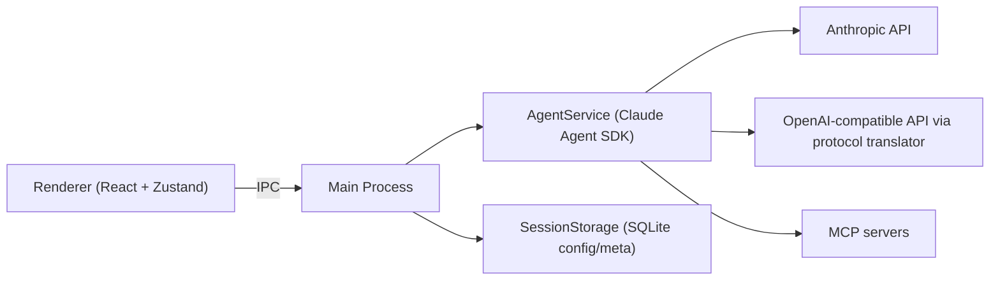

<div align="center">
  
  <h1>AI Desktop Assistant</h1>
  <p>
    A desktop AI workspace powered by <strong>Claude Agent SDK</strong>, built with Electron + React + TypeScript.
  </p>
  <p>
    <a href="./README.zh-CN.md">简体中文</a> | English
  </p>
</div>

<p align="center">
  <a href="https://github.com/fengye404/ai-desktop-assistant/releases">
    
  </a>
  <a href="https://github.com/fengye404/ai-desktop-assistant/blob/main/LICENSE">
    
  </a>
  
  
  
  <a href="https://github.com/fengye404/ai-desktop-assistant/stargazers">
    
  </a>
  <a href="https://github.com/fengye404/ai-desktop-assistant/issues">
    
  </a>
</p>

## Table Of Contents

- [Why This Project](#why-this-project)
- [Key Features](#key-features)
- [Architecture At A Glance](#architecture-at-a-glance)
- [Quick Start](#quick-start)
- [Configuration](#configuration)
- [Scripts](#scripts)
- [Documentation](#documentation)
- [Project Structure](#project-structure)
- [Contributing](#contributing)
- [License](#license)

## Why This Project

AI Desktop Assistant focuses on one workflow: keep AI-assisted development inside a native desktop app, with secure local config, streaming tool feedback, and extensible MCP integration.

Compared to a plain web chat, this project gives you:

- Native desktop experience (Electron)
- Real-time tool execution feedback in chat
- SDK-native session handling and sandbox mode
- Multi-provider model access (Anthropic + OpenAI-compatible)

## Key Features

- Claude Agent SDK as the execution core
- Multi-provider model routing
  - Anthropic direct
  - OpenAI-compatible endpoints via protocol translator
- Streaming conversation and tool-call timeline
- Inline tool approval and permission controls
- MCP server integration (stdio / SSE / HTTP)
- Runtime sandbox controls (`local` / `sandbox`)
- API key protection using Electron `safeStorage`

## Architecture At A Glance



## Quick Start

### Prerequisites

- Node.js LTS
- npm
- macOS or Windows

### Run From Source

```bash
npm install
npm run dev
```

### Build And Run

```bash
npm run build
npm start
```

## Configuration

Open `Settings` in the app and configure:

- Provider: `anthropic` or `openai`
- Model: e.g. `claude-sonnet-4-6`, `gpt-4o`, `deepseek-chat`
- API Key: encrypted and stored with `safeStorage`
- Base URL: required for OpenAI-compatible endpoints

## Scripts

| Command | Description |
| --- | --- |
| `npm run dev` | Start Electron + renderer dev workflow |
| `npm run build` | Build main and renderer bundles |
| `npm run start` | Build and launch desktop app |
| `npm run lint` | Run ESLint |
| `npm run typecheck` | Type-check main + renderer |
| `npm run test` | Run renderer/main tests |
| `npm run ci:verify` | Full CI verification locally |
| `npm run dist` | Package app with electron-builder |
| `npm run dist:mac` | Build macOS package |
| `npm run dist:win` | Build Windows package |

## Documentation

- [Docs Home](./docs/README.md)
- [System Architecture](./docs/architecture/system-architecture.md)
- [Architecture Notes](./docs/architecture/README.md)
- [Feature Docs](./docs/features/README.md)
- [Guides](./docs/guides/README.md)
- [API Reference](./docs/api/README.md)
- [Roadmap](./docs/roadmap.md)

## Project Structure

```text
src/
  main.ts                       Electron entry
  preload.ts                    IPC bridge
  agent-service.ts              Claude Agent SDK integration
  session-storage.ts            SQLite config/session metadata
  main-process/                 Main-process modules (IPC, MCP, skills, approvals)
  renderer/                     React app (components, stores, services)
docs/                           Product and architecture docs
scripts/                        Build/release scripts
public/branding/                App branding assets
```

## Contributing

Issues and pull requests are welcome.

- Report bugs: [Issues](https://github.com/fengye404/ai-desktop-assistant/issues)
- Suggest features: [Issues](https://github.com/fengye404/ai-desktop-assistant/issues)
- Before opening a PR, run:

```bash
npm run ci:verify
```

## License

MIT
