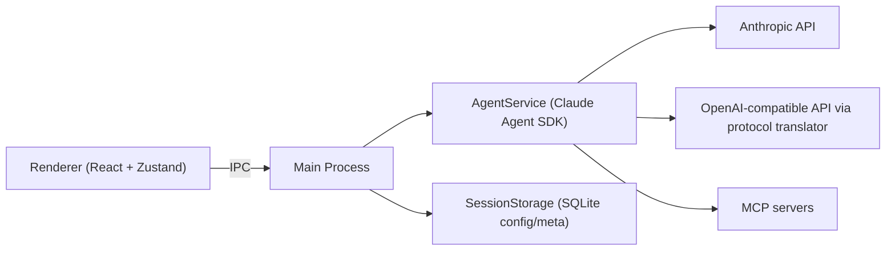

<div align="center">
  
  <h1>AI Desktop Assistant</h1>
  <p>
    基于 <strong>Claude Agent SDK</strong> 的桌面 AI 工作台，采用 Electron + React + TypeScript 构建。
  </p>
  <p>
    简体中文 | <a href="./README.md">English</a>
  </p>
</div>

<p align="center">
  <a href="https://github.com/fengye404/ai-desktop-assistant/releases">
    
  </a>
  <a href="https://github.com/fengye404/ai-desktop-assistant/blob/main/LICENSE">
    
  </a>
  
  
  
  <a href="https://github.com/fengye404/ai-desktop-assistant/stargazers">
    
  </a>
  <a href="https://github.com/fengye404/ai-desktop-assistant/issues">
    
  </a>
</p>

## 目录

- [项目定位](#项目定位)
- [核心特性](#核心特性)
- [架构总览](#架构总览)
- [快速开始](#快速开始)
- [配置说明](#配置说明)
- [常用命令](#常用命令)
- [文档导航](#文档导航)
- [项目结构](#项目结构)
- [参与贡献](#参与贡献)
- [许可证](#许可证)

## 项目定位

AI Desktop Assistant 的目标是把 AI 辅助开发流程放在一个本地桌面工作台中：配置本地安全存储、工具调用过程可视化、会话与沙箱能力由 SDK 原生驱动。

相比纯 Web 对话页，本项目强调：

- 桌面端原生体验
- 工具执行过程与审批反馈实时可见
- SDK 原生会话管理与沙箱切换
- 多模型提供商接入能力

## 核心特性

- 以 Claude Agent SDK 为执行核心
- 多提供商模型接入
  - Anthropic 直连
  - OpenAI 兼容接口（协议翻译）
- 对话流式渲染与工具调用时间线
- 内联工具审批与权限控制
- MCP 服务器扩展（stdio / SSE / HTTP）
- 运行时沙箱模式切换（`local` / `sandbox`）
- API Key 使用 Electron `safeStorage` 安全保存

## 架构总览



## 快速开始

### 环境要求

- Node.js LTS
- npm
- macOS 或 Windows

### 源码运行

```bash
npm install
npm run dev
```

### 构建并启动

```bash
npm run build
npm start
```

## 配置说明

在应用 `Settings` 中完成以下配置：

- Provider：`anthropic` 或 `openai`
- Model：例如 `claude-sonnet-4-6`、`gpt-4o`、`deepseek-chat`
- API Key：使用 `safeStorage` 加密保存
- Base URL：OpenAI 兼容接口场景需要

## 常用命令

| 命令 | 说明 |
| --- | --- |
| `npm run dev` | 启动 Electron + 渲染层开发流程 |
| `npm run build` | 构建主进程和渲染进程 |
| `npm run start` | 构建后启动桌面应用 |
| `npm run lint` | 执行 ESLint |
| `npm run typecheck` | 主进程 + 渲染层类型检查 |
| `npm run test` | 执行主流程测试 |
| `npm run ci:verify` | 本地执行完整 CI 校验 |
| `npm run dist` | 使用 electron-builder 打包 |
| `npm run dist:mac` | 构建 macOS 包 |
| `npm run dist:win` | 构建 Windows 包 |

## 文档导航

- [文档首页](./docs/README.md)
- [系统架构](./docs/architecture/system-architecture.md)
- [架构记录](./docs/architecture/README.md)
- [功能文档](./docs/features/README.md)
- [使用指南](./docs/guides/README.md)
- [API 参考](./docs/api/README.md)
- [路线图](./docs/roadmap.md)

## 项目结构

```text
src/
  main.ts                       Electron 入口
  preload.ts                    IPC 桥接
  agent-service.ts              Claude Agent SDK 集成
  session-storage.ts            SQLite 配置/会话元数据
  main-process/                 主进程模块（IPC、MCP、技能、审批）
  renderer/                     React 应用（components/stores/services）
docs/                           产品与架构文档
scripts/                        构建与发布脚本
public/branding/                应用品牌资源
```

## 参与贡献

欢迎提交 Issue 和 PR。

- 问题反馈：[Issues](https://github.com/fengye404/ai-desktop-assistant/issues)
- 功能建议：[Issues](https://github.com/fengye404/ai-desktop-assistant/issues)
- 提交 PR 前建议先运行：

```bash
npm run ci:verify
```

## 许可证

MIT
